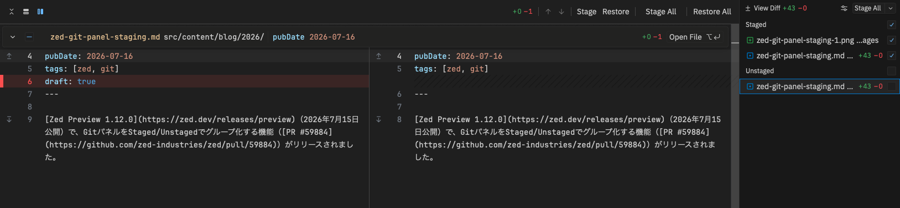
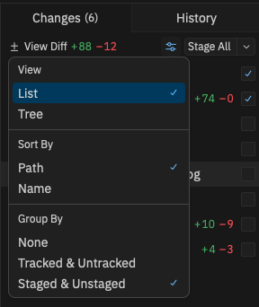

[Zed Preview 1.12.0](https://zed.dev/releases/preview)（2026年7月15日公開）で、GitパネルをStaged/Unstagedでグループ化する機能（[PR #59884](https://github.com/zed-industries/zed/pull/59884)）がリリースされました。

Zedを使っていてVSCodeが恋しくなる一番の原因はGit関連の機能でしたが、最近はGit関連機能がガンガンリリースされており、その弱点は解消されつつあります。

## 何ができるようになったか

Gitパネルの表示オプションに**Staging**というグループ化モードが追加され、変更ファイルが次の2セクションに分かれて表示されるようになりました。

単に一覧が分かれるだけではなく、差分表示も連動します。Staged側のファイルを開くとStaged Changesの差分が、Unstaged側ならUnstaged Changesの差分が開きます。まさにVSCodeのソース管理パネルと同じ操作感です。各セクションの見出しにはステージ・アンステージ用の`+`/`−`ボタンも付いています。

## 設定方法

デフォルトでは有効になっていないので、明示的に切り替える必要があります。

1. Zed Preview 1.12.0以降を起動する
2. Gitパネルを開く
3. パネル上部の**View Options**メニューを開く
4. **Group By → Staged & Unstaged**を選択する

## VSCodeから完全移行できる日は近いかも

VSCodeのGit機能を普段から使いまくっている私には、Zedへの移行ハードルが高いと感じていたのですが、ZedのGit機能はここ数リリースで急速に拡充されています。ひとつ前のPreview 1.11.0でも、`git: view staged changes`/`git: view unstaged changes`という専用アクションが追加されていましたし、Git Graphもいつの間にか標準装備していました。弱点だったGit周りが次々と埋まっていくのを見ていると、開発チームが本気でここに取り組んでいるのが伝わってきます。

完全移行できる日も近いかもしれません。

## 参考

- [Zed Preview Releases](https://zed.dev/releases/preview)
- [git_panel: Add group by staging view option #59884](https://github.com/zed-industries/zed/pull/59884)
